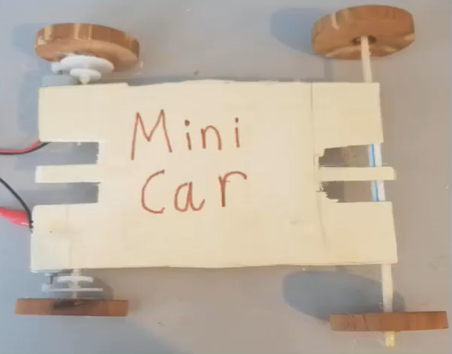

# Rover

Creating a Bluetooth app controlled rover for my Youtube Channel. I used MIT App Inventor and the Arduino IDE to make my project. I also posted a youtube video about my project. See it below

[Youtube Video!](https://www.youtube.com/watch?v=267AWryYdZc&feature=youtu.be)

